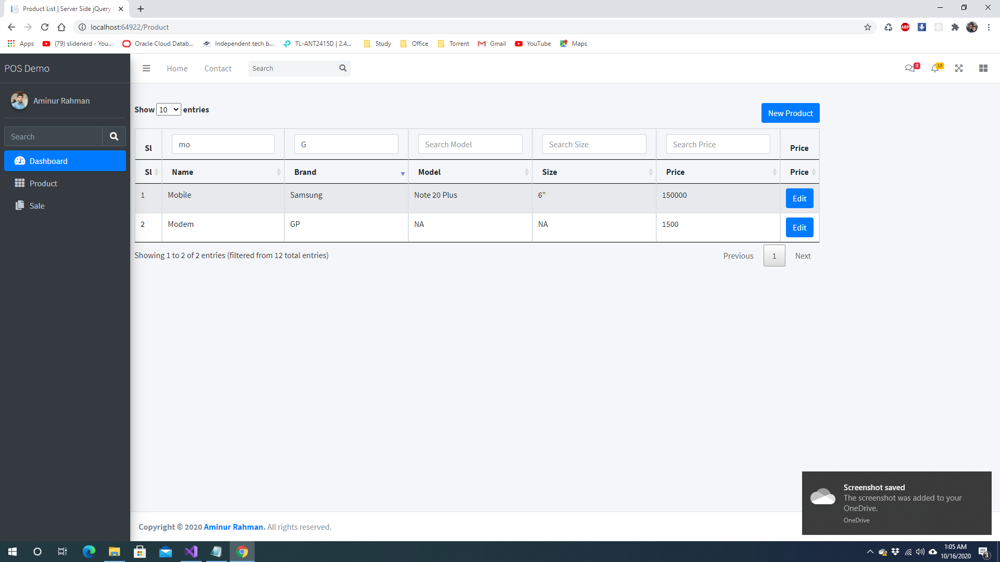
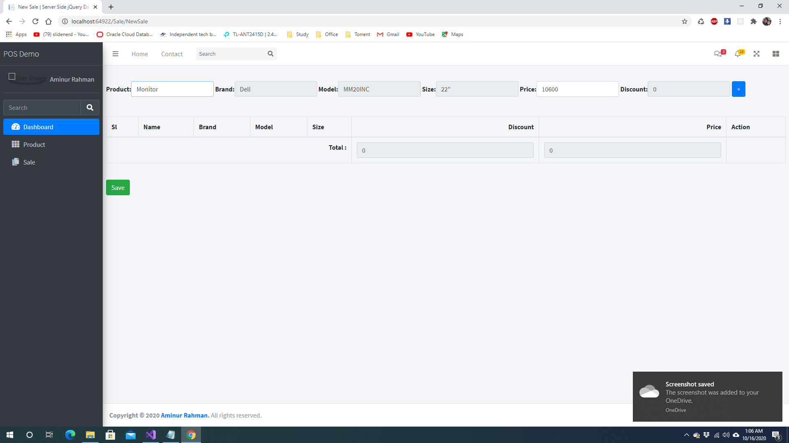

  <h1>Server Side jQuery-Datatable in DotNet Core 3.1</h1>

  Connect with me :
  
  <a href="www.facebook.com/aminur6264" target="_blank">Facebook</a>
  <a href="www.facebook.com/aminur6264" target="_blank">Facebook</a>
  <a href="www.facebook.com/aminur6264" target="_blank">Facebook</a>

  

  

  

  

  

  

  

  

  

  

  

  

  

  

  

